# Laso Digital Health - Healthcare Appointment System

Laso Digital Health is a modern healthcare appointment booking system that connects patients with doctors. The platform streamlines the process of finding doctors, booking appointments, and managing medical consultations.

Live: [Demo](http://doccure.manjurulhoque.com/)

## Features

### For Patients
- Search doctors by specialization, location, or name
- View doctor profiles and availability
- Book appointments online
- Manage appointments (view, cancel, print)
- Digital appointment records/patient history
- Personal health profile management
- View booking history and invoices
- Submit reviews and ratings for doctors

### For Doctors
- Professional profile management
- Schedule management
- Appointment handling (accept, reject, complete)
- Patient records access
- View patient history
- Manage consultation fees
- Track appointments and bookings
- Write digital prescriptions
- View earnings and statistics

### For Administrators
- Comprehensive dashboard
- User management (doctors & patients)
- Appointment oversight
- Revenue tracking and analysis
- Advanced reporting features:
  - Appointment analytics
  - Revenue statistics
  - Doctor performance metrics
  - Monthly trends visualization
  - Financial summaries
- Specialization management
- Review moderation
- Prescription monitoring

### General Features
- User authentication and authorization
- Responsive design
- Secure data handling
- Digital invoicing
- Rating and review system
- Interactive charts and statistics
- Real-time data visualization
- Role-based access control

## Tech Stack

### Backend
- Python 3.8+
- Django 5
- Django REST Framework
- SQLite3 (default database)

### Frontend
- HTML5, CSS3, JavaScript
- Bootstrap 4
- jQuery
- Chart.js for analytics
- HTMX for dynamic content
- Font Awesome icons

### Additional Tools
- Pillow for image handling
- Django Crispy Forms
- CKEditor for rich text editing

## Installation

1. Clone the repository

bash
git clone https://github.com/manjurulhoque/doccure.git
cd doccure

2. Create a virtual environment
```bash
python -m venv venv
source venv/bin/activate  # On Windows use: venv\Scripts\activate
```

3. Install dependencies
```bash
pip install -r requirements.txt
```

4. Set up the database
```bash
python manage.py migrate
```

5. Create a superuser
```bash
python manage.py createsuperuser
```

6. Load sample data (optional)
```bash
python manage.py loaddata fixtures/initial_data.json
```

7. Run the development server
```bash
python manage.py runserver
```

8. Visit http://localhost:8005 in your browser

## Environment Variables
Create a `.env` file in the project root and add:

```
SECRET_KEY=your_secret_key
DEBUG=True
ALLOWED_HOSTS=localhost,127.0.0.1
```

## Demo Users
After loading fixtures, you can use these demo accounts:

**Doctor Account:**
- Username: doctor1
- Password: Abcdefgh.1

**Patient Account:**
- Username: patient1
- Password: Abcdefgh.1

## Contributing
1. Fork the repository
2. Create a new branch
3. Make your changes
4. Submit a pull request

## License
This project is licensed under the MIT License - see the LICENSE file for details.

## Support
For support, email support@doccure.com or create an issue in the repository.

## 📸 Screenshots

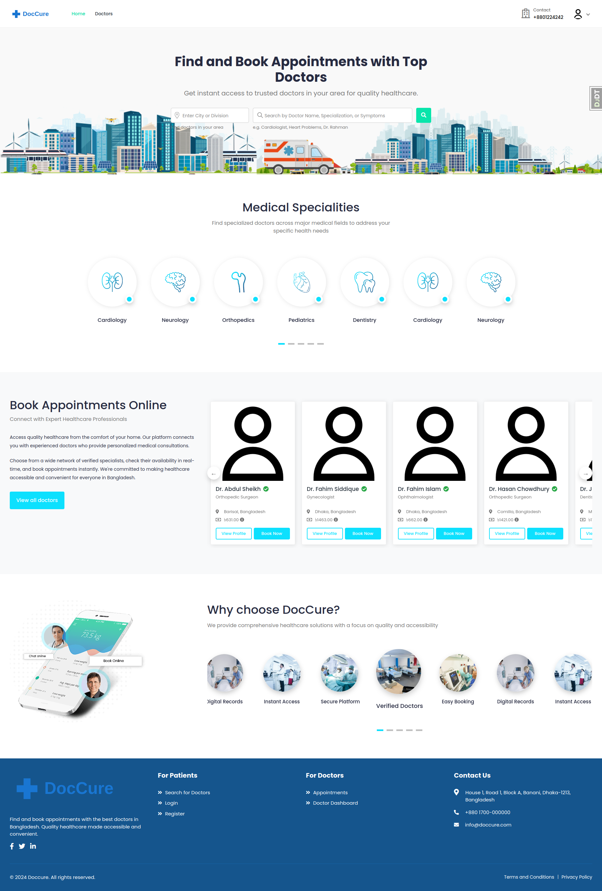
*Home page*

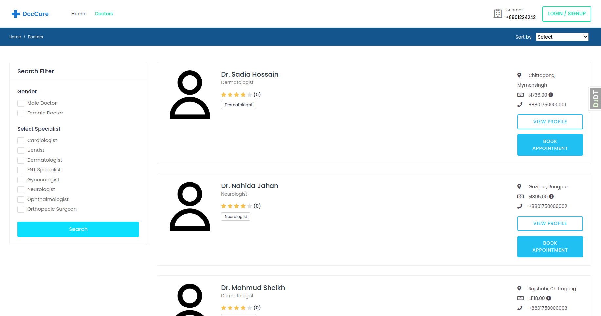
*Doctors page with pagination*

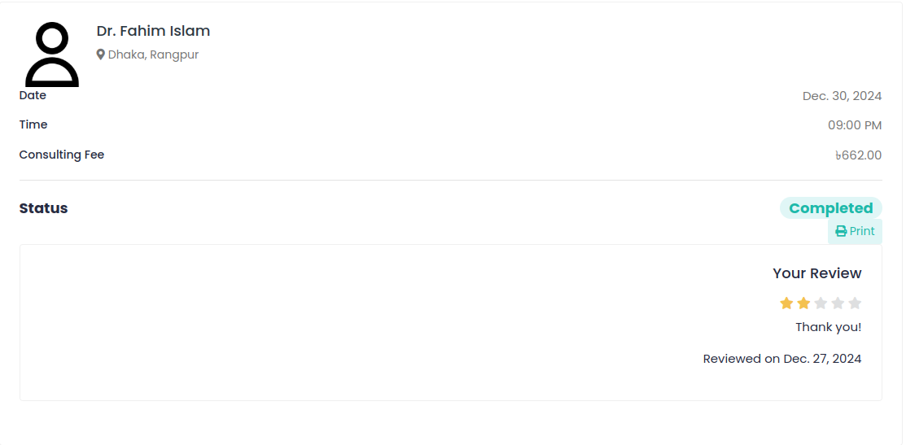
*Appointment review page*

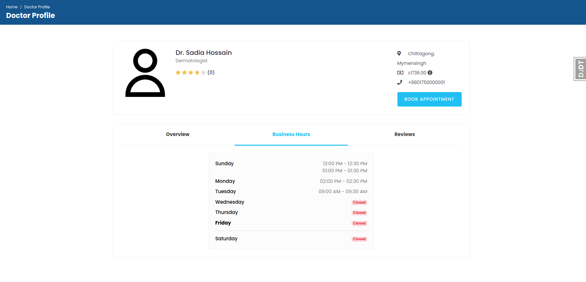
*Doctor profile page*

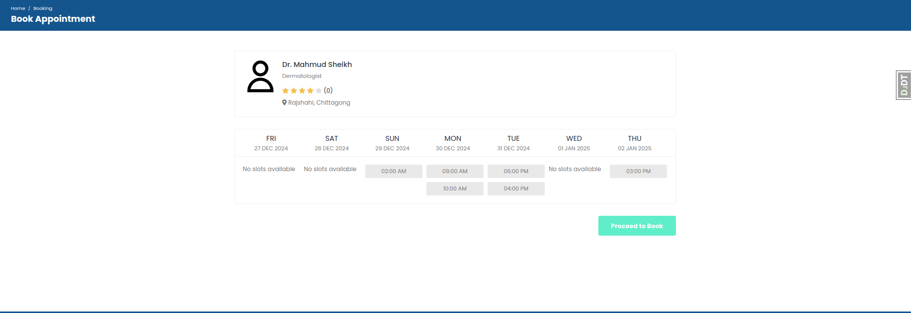
*Doctor schedules page*

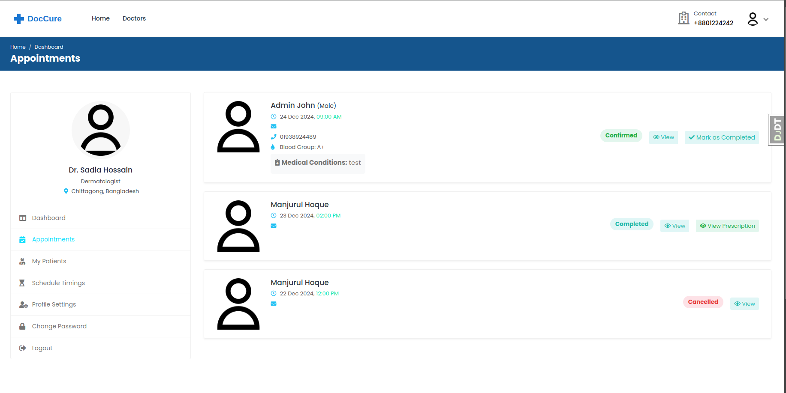
*Doctor appointments*

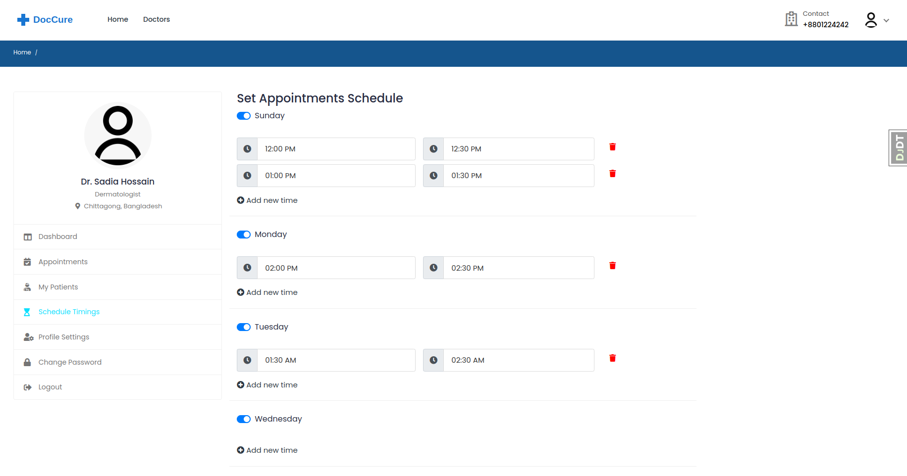
*Doctor schedule timings*

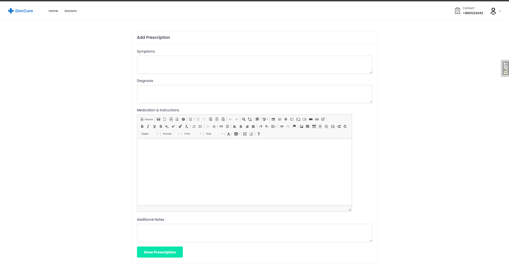
*Doctor add prescription*

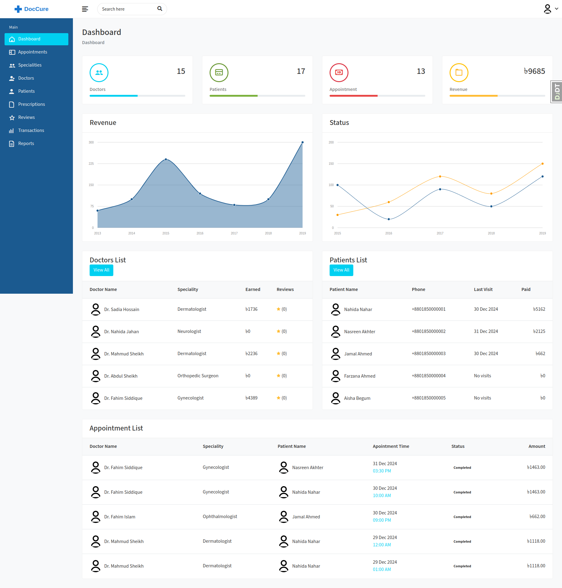
*Admin dashboard page*

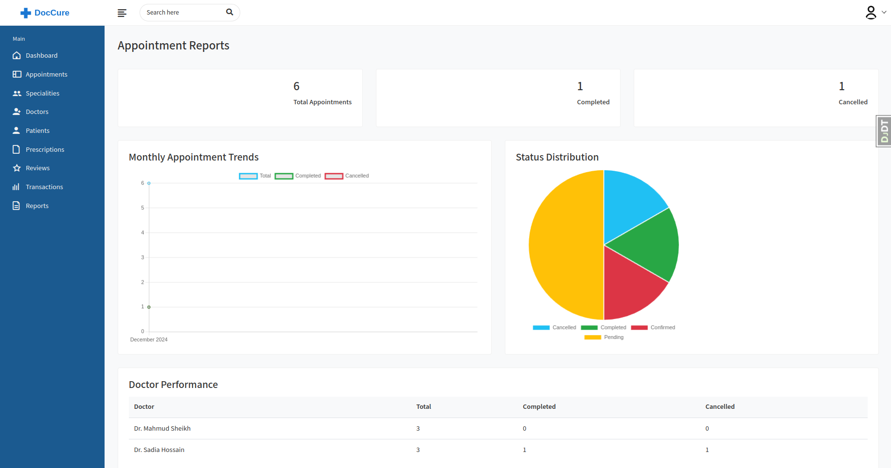
*Admin report page*

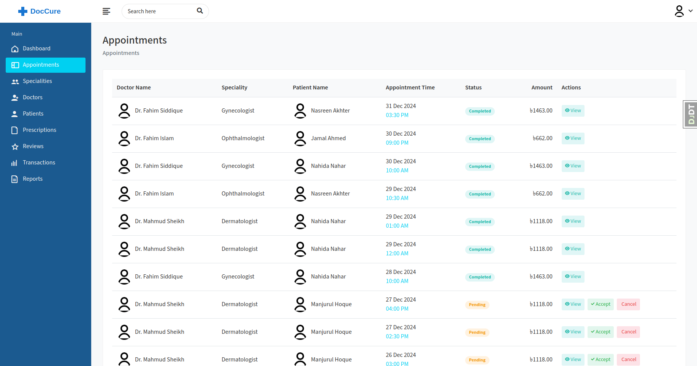
*Admin appointments page*

## Conclusion

Laso Digital Health aims to modernize healthcare access in Bangladesh by:

1. **Simplified Booking**: Making it easy for patients to find and book appointments with qualified doctors
2. **Digital Management**: Helping doctors manage their practice more efficiently
3. **Better Healthcare Access**: Improving access to healthcare through technology
4. **Secure Platform**: Ensuring patient data privacy and security
5. **Paperless System**: Reducing paperwork through digital records

### Future Improvements

- Integration with video consultation
- Mobile app development
- SMS notifications
- Online payment integration
- AI-powered doctor recommendations
- Multi-language support
- Advanced analytics and reporting
- Email notification system
- Patient feedback system
- Appointment reminder system

### Project Status

This project is actively maintained and open for contributions. Core features are implemented including the new reporting system, but we welcome improvements and new feature additions from the community.

---
Built with ❤️ for better healthcare access


